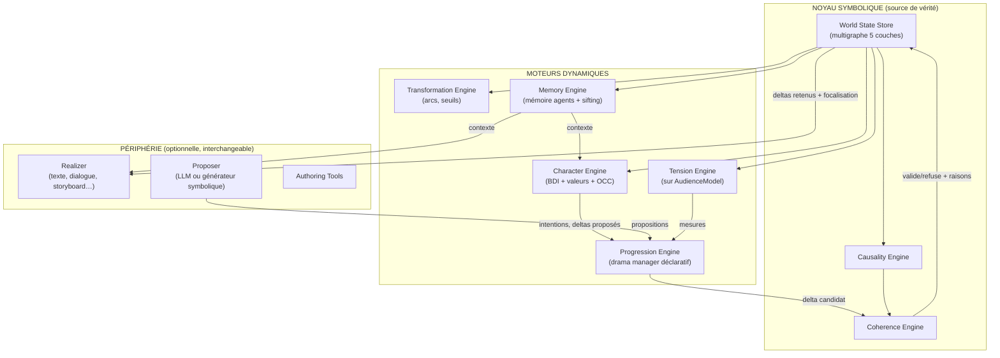

# Phase 1 — Architecture v0 du Narrative OS

Statut : architecture de référence issue de l'état de l'art (aucun code encore — la
Phase 3 implémentera le noyau). Chaque module : responsabilité unique, interfaces, E/S,
stratégie de test, et justification.

## 1. Vue d'ensemble

Boucle d'exécution (patron engagement-réflexion, MEXICA ; arbitrage Façade/QBN) :

1. Les sources (Character Engine, Proposer, contenu auteurisé) **proposent** des deltas
   ou mécaniques éligibles (préconditions satisfaites sur le graphe).
2. Le **Progression Engine** choisit selon les objectifs déclaratifs (cibles de tension,
   dettes à solder, arcs à faire avancer, contraintes de genre).
3. Le **Coherence Engine** vérifie (causalité, épistémique, continuité) ; refus motivé ou
   commit dans le **World State Store**.
4. Les moteurs dérivés se mettent à jour (émotions, tension, arcs, mémoire).
5. Le **Realizer** projette les deltas retenus en surface (texte, dialogue, image, ou
   sortie structurée pure).

Le LLM peut occuper `Proposer` et `Realizer` — et seulement ces cases (décision D5).

## 2. Modules

### 2.1 World State Store
- **Responsabilité** : unique source de vérité — le multigraphe 5 couches
  (`05-ontologie-v0.md` §2), versionné par delta (event sourcing : l'historique des
  deltas *est* la fabula).
- **Entrées** : deltas validés. **Sorties** : requêtes typées (état à t, motifs,
  parcours causal), snapshots, time-travel (inspiré rollback Ren'Py — précieux pour le
  débogage narratif et les mondes alternatifs de Ryan).
- **Tests** : propriétés (commit/rollback idempotents), requêtes de référence sur récits
  annotés.
- **Justification** : Inform 7 (relations/règles) + event sourcing (chaque état passé
  reste interrogeable — indispensable au twist, qui relit le passé).

### 2.2 Causality Engine
- **Responsabilité** : maintenir/inférer les arêtes causales typées ; répondre à
  « pourquoi ? » et « qu'est-ce que cela rend possible/impossible ? » ; détecter les
  conflits (interférences de plans, CPOCL) et l'irréversibilité (fermeture de futurs —
  inspiration logique linéaire, Ceptre).
- **E/S** : in : deltas + règles causales du domaine ; out : arêtes, conflits détectés,
  espace des futurs accessibles (horizon borné).
- **Tests** : récits de référence → chaînes causales attendues ; injection de deltas
  incohérents → détection.
- **Justification** : fabula model ; IPOCL ; limite d'échelle de la planification
  documentée → inférence locale à horizon court, jamais planification globale.

### 2.3 Coherence Engine
- **Responsabilité** : gardien du commit. Vérifie : causalité (I4), cohérence épistémique
  (un agent n'agit pas sur ce qu'il ignore — erreur LLM classique), continuité factuelle,
  respect des contraintes déclaratives (genre, canon, rating pédagogique…).
- **Sortie clé** : le **refus motivé** (quelle règle, quel fait, quelle alternative) —
  c'est ce qui rend le système explicable et ce qui « éduque » un Proposer LLM.
- **Tests** : corpus de violations synthétiques (anachronismes, fuites de secret,
  téléportations) → 100 % de détection attendue sur les classes couvertes.
- **Justification** : c'est le module qui capture les échecs documentés des LLMs
  (`03-recherche-ia.md` §6) ; analogue narratif d'un type-checker.

### 2.4 Character Engine
- **Responsabilité** : pour chaque agent — appraisal OCC des deltas perçus (émotions
  dérivées), mise à jour des croyances (selon `scope` des deltas), délibération BDI
  (want/need, valeurs, volitions sociales à la CiF), production d'intentions et de
  triades de Bremond.
- **E/S** : in : deltas perçus par l'agent ; out : deltas proposés + justification
  intentionnelle (chaque action est rattachée à but+croyances : exigence IPOCL,
  condition d'explicabilité).
- **Tests** : scénarios sociaux étalons (Prom Week-like) ; vérif de constance
  émotionnelle (pas de joie sur un événement contraire aux buts, sauf règle explicite).
- **Justification** : BDI + OCC + CiF, tous validés séparément ; l'ajout valeurs/
  engagements vient de Truby/Ryan/I7.

### 2.5 Tension Engine
- **Responsabilité** : calculer le **vecteur de tension** (suspense, mystère,
  anticipation, ironie dramatique) sur l'**AudienceModel** : incertitude sur les futurs
  accessibles × enjeux (charges de valeur) × proximité (I10) ; tenir à jour la **dette
  narrative** (engagements ouverts, indices non payés).
- **E/S** : in : WorldGraph + couche discours (ce que l'audience a vu) ; out : mesures
  datées, alertes (tension plate, dette excessive, ironie disponible non exploitée).
- **Tests** : corrélation avec annotations humaines de suspense sur récits de référence
  (protocole défini en Phase 2).
- **Justification** : Suspenser/Dramatis (calcul sur le récepteur) ; Sternberg ;
  amélioration : multi-dimensionnel au lieu de la courbe unique de Façade.

### 2.6 Progression Engine (drama manager déclaratif)
- **Responsabilité** : choisir le prochain delta/mécanique parmi les éligibles pour
  suivre des **objectifs déclaratifs** : profils de tension cibles (par genre, chargés
  comme données), dettes à solder avant clôture, arcs à faire progresser, équilibre
  disruption/rétablissement (I8), agency de l'utilisateur en mode interactif (Murray).
- **E/S** : in : propositions + mesures + contraintes ; out : delta candidat (vers
  Coherence), demandes aux sources (« il me faut une escalade sur l'axe loyauté »).
- **Tests** : simulation à politiques contrastées → profils de tension mesurés conformes
  aux profils demandés.
- **Justification** : drama management (Weyhrauch ; TTD-MDP) + sélection storylet (QBN) ;
  amélioration : objectifs exprimés sur les mesures des invariants, pas sur des actes.

### 2.7 Transformation Engine
- **Responsabilité** : suivre les Arcs (chaînes de deltas irréversibles sur identité/
  croyances/valeurs), détecter les seuils franchis, signaler les arcs stagnants ou
  incohérents (une self-revelation sans deltas préparatoires = non gagnée,
  « unearned » — vérifiable par la densité causale amont).
- **Justification** : Campbell/Truby réencodés en mesures ; I9.

### 2.8 Memory Engine
- **Responsabilité** : (a) mémoire de chaque agent = sous-graphe daté de croyances avec
  récupération récence×importance×pertinence et **réflexion** (Generative Agents),
  oubli/distorsion comme opérations typées ; (b) **story sifting** (Kreminski) : extraire
  et scorer les chaînes tellables (I12) — sert le résumé, la mémoire longue du système,
  et la détection d'histoires émergentes ; (c) compression du contexte fourni au Realizer.
- **Tests** : rappel correct après N événements ; le sifting retrouve les chaînes
  annotées comme tellables dans des logs de simulation.

### 2.9 Périphérie
- **Realizer** (interface `realize(deltas, focalisation, style) → surface`) :
  implémentations texte-LLM, gabarits sans LLM (preuve d'indépendance : le système doit
  produire un récit lisible, même plat, sans aucun modèle), dialogue, storyboard.
- **Proposer** (interface `propose(contexte, requête) → [delta candidat]`) : LLM,
  bibliothèque de mécaniques, contenu auteurisé. Tout passe par Coherence.
- **Authoring** : édition du monde, des mécaniques, des profils de genre ; le graphe
  visible (leçon Twine) ; ergonomie proche de l'écriture (leçon Ink/Yarn).

## 3. Contrats d'indépendance

- Chaque moteur ne dépend que du World State Store et d'interfaces (jamais d'un autre
  moteur concret) ; tout moteur dynamique est débrayable (sans Tension Engine, le système
  dégrade en simulateur cohérent type Inform 7 — dégradation gracieuse, testable).
- Aucun module noyau n'importe de SDK de modèle ; les adaptateurs LLM vivent derrière
  `Proposer`/`Realizer` et sont substituables (n'importe quel fournisseur, ou aucun).
- Formats d'échange : JSON Schema versionnés (Phase 2) ; toute mécanique/profil de genre
  est **données**, jamais code du noyau.

## 4. Risques identifiés

| Risque | Source | Mitigation prévue |
|---|---|---|
| Coût d'authoring (mur de Façade/Versu) | §2.11 de l'EDA moteurs | LLM en outil d'authoring ; mécaniques génériques réutilisables ; mesurer le coût dès la Phase 3 |
| Explosion combinatoire causale | littérature planification | horizons bornés, inférence locale, abstraction hiérarchique |
| Tension calculée ≠ tension ressentie | validité écologique | protocole d'annotation humaine (Phase 7) dès les premiers prototypes |
| Sur-ontologisation (usine à gaz) | expérience story grammars | noyau minimal (delta + 5 couches) ; tout le reste dérivé ou optionnel |
